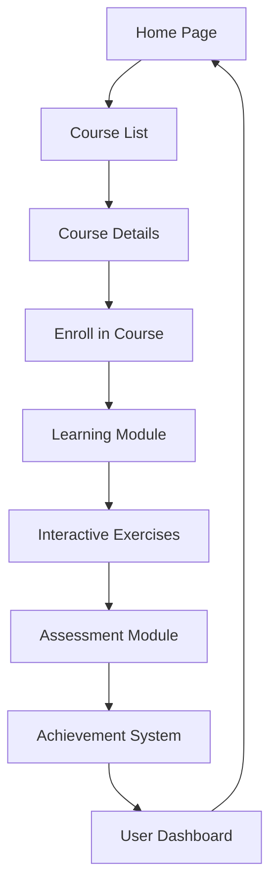

## 1. Product Overview
基于Python的数据分析在线教育平台，专为商务数据分析与应用专业的学生设计，提供完整的课程体系和互动式学习体验。
- 解决学生在数据分析学习过程中的实践与测评需求，帮助他们掌握实用的数据分析技能
- 目标用户为商务数据分析与应用专业的学生，市场价值在于提升学生的就业竞争力和专业技能

## 2. Core Features

### 2.1 User Roles
| Role | Registration Method | Core Permissions |
|------|---------------------|------------------|
| Student | Email registration | Access courses, complete exercises, take assessments, track progress |
| Instructor | Admin invitation | Manage courses, review submissions, track student progress |

### 2.2 Feature Module
1. **Home page**: Hero section, course categories, featured courses, user dashboard
2. **Course page**: Course details, curriculum, lessons, interactive exercises
3. **Learning module**: Video lessons, code editors, interactive exercises
4. **Assessment module**: Quizzes, projects, grading system
5. **Achievement system**: Badges, certificates, progress tracking
6. **User dashboard**: Personal progress, completed courses, achievements

### 2.3 Page Details
| Page Name | Module Name | Feature description |
|-----------|-------------|---------------------|
| Home page | Hero section | Introduction to the platform, key features, call-to-action |
| Home page | Course categories | Browse courses by category (Python basics, data visualization, machine learning, etc.) |
| Home page | Featured courses | Highlight popular or recommended courses |
| Home page | User dashboard | Quick overview of current progress and upcoming tasks |
| Course page | Course details | Course description, prerequisites, duration, instructor info |
| Course page | Curriculum | Detailed course outline with lessons and topics |
| Learning module | Video lessons | Embedded video content with playback controls |
| Learning module | Code editors | Interactive Python code editors for hands-on practice |
| Learning module | Interactive exercises | Step-by-step exercises with immediate feedback |
| Assessment module | Quizzes | Multiple-choice and coding quizzes with automatic grading |
| Assessment module | Projects | Real-world data analysis projects with submission and feedback |
| Achievement system | Badges | Earn badges for completing courses, exercises, and milestones |
| Achievement system | Certificates | Generate certificates for completed courses |
| Achievement system | Progress tracking | Visual representation of learning progress |
| User dashboard | Personal progress | Track completed courses, current courses, and overall progress |
| User dashboard | Achievements | View earned badges and certificates |

## 3. Core Process
### Main User Flow
1. User registers or logs in to the platform
2. User browses courses and selects one to enroll
3. User accesses course content and completes lessons
4. User practices with interactive exercises and coding challenges
5. User takes assessments to test knowledge
6. User earns badges and certificates for achievements
7. User tracks progress through the dashboard

## 4. User Interface Design
### 4.1 Design Style
- Primary color: #4A6FA5 (professional blue)
- Secondary color: #F9A826 (accent orange)
- Button style: Rounded corners (8px), subtle shadows
- Font: Inter for body text, Roboto for headings
- Layout style: Card-based with clean spacing, top navigation
- Icon style: Modern, minimalist, using Lucide React icons

### 4.2 Page Design Overview
| Page Name | Module Name | UI Elements |
|-----------|-------------|-------------|
| Home page | Hero section | Full-width banner with gradient background, clear headline, CTA button, animated data visualization elements |
| Home page | Course categories | Grid of category cards with icons, hover effects, smooth transitions |
| Home page | Featured courses | Carousel of course cards with course image, title, instructor, rating |
| Home page | User dashboard | Widget-based layout with progress bars, recent activity, upcoming tasks |
| Course page | Course details | Hero image, course title, instructor info, progress indicator, enrollment button |
| Course page | Curriculum | Collapsible sections for each module, lesson list with completion status |
| Learning module | Video lessons | Responsive video player, lesson navigation, progress tracking |
| Learning module | Code editors | Syntax-highlighted code editor, run button, output display, error feedback |
| Learning module | Interactive exercises | Step-by-step instructions, input fields, submit button, immediate feedback |
| Assessment module | Quizzes | Multiple-choice questions, progress bar, submit button, result summary |
| Assessment module | Projects | Project description, submission form, file upload, feedback section |
| Achievement system | Badges | Grid of badge icons with unlock status, hover tooltips with details |
| Achievement system | Certificates | Certificate preview, download option, shareable link |
| Achievement system | Progress tracking | Interactive progress chart, milestone indicators |
| User dashboard | Personal progress | Dashboard with cards for current courses, completed courses, skills gained |
| User dashboard | Achievements | Trophy case style display of earned badges and certificates |

### 4.3 Responsiveness
- Desktop-first design with mobile-adaptive layout
- Breakpoints: 1200px (desktop), 768px (tablet), 480px (mobile)
- Touch optimization for mobile devices, including larger buttons and swipe gestures
- Collapsible navigation menu for mobile devices

### 4.4 3D Scene Guidance
Not applicable for this project.