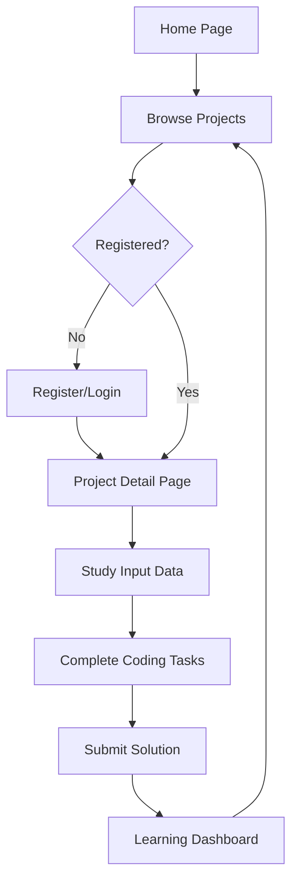

## 1. Product Overview
AI时代的数据分析课程训练平台，提供10个电商/零售场景的pandas实战项目，帮助用户掌握数据分析技能。
- 目标用户：数据分析师、数据科学家、商科学生和对数据分析感兴趣的学习者
- 市场价值：提供实战导向的pandas技能培训，满足AI时代对数据人才的需求

## 2. Core Features

### 2.1 User Roles
| Role | Registration Method | Core Permissions |
|------|---------------------|------------------|
| Guest User | No registration required | Access basic project descriptions and sample code |
| Registered User | Email registration | Full access to all projects, save progress, submit solutions |

### 2.2 Feature Module
1. **Home Page**: Hero section, project list, difficulty levels, registration/login
2. **Project Detail Page**: Project description, input data format, task goals, output requirements, code editor
3. **Learning Dashboard**: Progress tracking, completed projects, skills assessment

### 2.3 Page Details
| Page Name | Module Name | Feature description |
|-----------|-------------|---------------------|
| Home Page | Hero Section | Introduction to the platform, key features, call-to-action for registration |
| Home Page | Project List | Display 10 pandas projects with difficulty indicators, brief descriptions, and access buttons |
| Home Page | Registration/Login | User account creation and authentication |
| Project Detail Page | Project Description | Detailed explanation of the project, business context, and learning objectives |
| Project Detail Page | Input Data Format | Sample data structure, field descriptions, and data generation options |
| Project Detail Page | Task Goals | Step-by-step instructions for completing the project |
| Project Detail Page | Output Requirements | Expected results, visualization examples, and evaluation criteria |
| Project Detail Page | Code Editor | Interactive code environment with pandas pre-loaded, run button, and output display |
| Learning Dashboard | Progress Tracking | Visual representation of completed projects and skills acquired |
| Learning Dashboard | Skills Assessment | Summary of pandas skills mastered and areas for improvement |

## 3. Core Process
User flow: Visit home page → Browse projects → Register/login → Access project details → Study input data format → Complete coding tasks → Submit solution → Track progress in dashboard

## 4. User Interface Design
### 4.1 Design Style
- Primary color: #4361ee (deep blue)
- Secondary color: #3a0ca3 (purple)
- Accent color: #f72585 (pink)
- Button style: Rounded corners (8px), subtle shadow, hover effects
- Font: Inter for body text, Poppins for headings
- Layout style: Card-based with ample white space, clean typography
- Icon style: Modern, minimalist line icons

### 4.2 Page Design Overview
| Page Name | Module Name | UI Elements |
|-----------|-------------|-------------|
| Home Page | Hero Section | Large gradient background, bold headline, brief description, call-to-action button |
| Home Page | Project List | Grid of project cards with difficulty badges, project title, brief description, and access button |
| Project Detail Page | Project Description | Clear section headers, well-structured content, code snippets with syntax highlighting |
| Project Detail Page | Code Editor | Split-screen layout with code editor on left and output on right, run button, save progress button |
| Learning Dashboard | Progress Tracking | Interactive chart showing completed projects, skill proficiency bars, recent activity feed |

### 4.3 Responsiveness
- Desktop-first design with responsive breakpoints
- Mobile-adaptive layout with stacked elements on smaller screens
- Touch optimization for mobile devices
- Accessible design with proper contrast and keyboard navigation

### 4.4 3D Scene Guidance
- Not applicable for this project