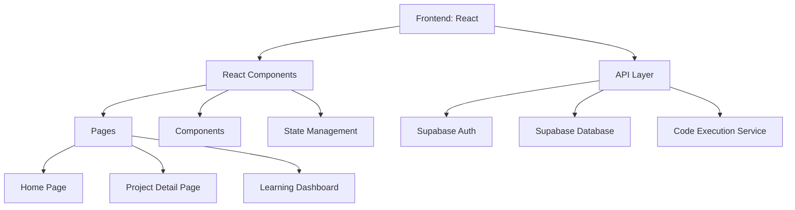
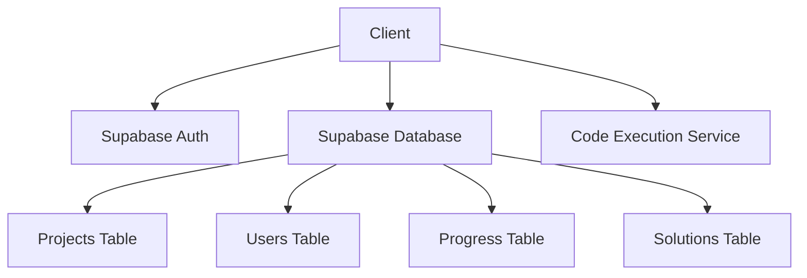
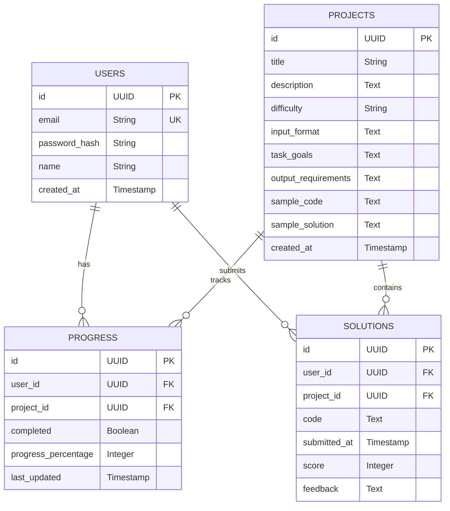

## 1. Architecture Design


## 2. Technology Description
- Frontend: React@18 + TypeScript + Tailwind CSS@3 + Vite
- Initialization Tool: vite-init
- Backend: Supabase (Authentication, Database)
- Database: Supabase (PostgreSQL)
- Additional Libraries:
  - React Router for navigation
  - Zustand for state management
  - Monaco Editor for code editing
  - Recharts for data visualization
  - Supabase Client SDK for authentication and data operations

## 3. Route Definitions
| Route | Purpose |
|-------|---------|
| / | Home page with project list |
| /project/:id | Project detail page with code editor |
| /dashboard | Learning dashboard with progress tracking |
| /login | Login page |
| /register | Registration page |

## 4. API Definitions
### Authentication API
- POST /auth/signup: User registration
- POST /auth/signin: User login
- POST /auth/signout: User logout
- GET /auth/user: Get current user information

### Project API
- GET /projects: Get all projects
- GET /projects/:id: Get project details
- POST /projects/:id/submit: Submit project solution
- GET /projects/:id/solution: Get sample solution

### Progress API
- GET /progress: Get user progress
- PUT /progress/:projectId: Update project progress

## 5. Server Architecture Diagram


## 6. Data Model
### 6.1 Data Model Definition


### 6.2 Data Definition Language
```sql
-- Create Users Table
CREATE TABLE users (
    id UUID PRIMARY KEY DEFAULT gen_random_uuid(),
    email TEXT UNIQUE NOT NULL,
    password_hash TEXT NOT NULL,
    name TEXT,
    created_at TIMESTAMP DEFAULT NOW()
);

-- Create Projects Table
CREATE TABLE projects (
    id UUID PRIMARY KEY DEFAULT gen_random_uuid(),
    title TEXT NOT NULL,
    description TEXT NOT NULL,
    difficulty TEXT NOT NULL,
    input_format TEXT NOT NULL,
    task_goals TEXT NOT NULL,
    output_requirements TEXT NOT NULL,
    sample_code TEXT,
    sample_solution TEXT,
    created_at TIMESTAMP DEFAULT NOW()
);

-- Create Progress Table
CREATE TABLE progress (
    id UUID PRIMARY KEY DEFAULT gen_random_uuid(),
    user_id UUID REFERENCES users(id),
    project_id UUID REFERENCES projects(id),
    completed BOOLEAN DEFAULT FALSE,
    progress_percentage INTEGER DEFAULT 0,
    last_updated TIMESTAMP DEFAULT NOW()
);

-- Create Solutions Table
CREATE TABLE solutions (
    id UUID PRIMARY KEY DEFAULT gen_random_uuid(),
    user_id UUID REFERENCES users(id),
    project_id UUID REFERENCES projects(id),
    code TEXT NOT NULL,
    submitted_at TIMESTAMP DEFAULT NOW(),
    score INTEGER,
    feedback TEXT
);

-- Insert Sample Projects
INSERT INTO projects (title, description, difficulty, input_format, task_goals, output_requirements)
VALUES
('基础数据清洗 - 订单数据预处理', '处理订单数据中的缺失值、异常值和格式问题', 'beginner', 'orders.csv with order_id, customer_id, order_date, amount, status, product_id, quantity', '1. 处理日期格式不统一问题
2. 识别并处理缺失值
3. 检测并处理异常值
4. 数据类型转换', '清洗后的订单数据，包含标准化的日期格式、合理的数值范围
数据质量报告，包括缺失值和异常值的处理情况'),
('用户行为分析 - 浏览与购买转化', '分析用户从浏览到购买的转化路径', 'beginner', 'user_behavior.csv with user_id, timestamp, behavior_type, product_id, category_id', '1. 计算不同行为类型的分布
2. 分析用户从浏览到购买的转化路径
3. 识别高转化品类', '用户行为漏斗分析报告
各品类转化率排名
转化时间分布分析'),
('购物篮关联分析 - 商品组合推荐', '使用关联规则分析商品组合', 'intermediate', 'order_items.csv with order_id, product_id, product_name, quantity, price', '1. 使用关联规则算法分析商品组合
2. 计算支持度、置信度和提升度
3. 识别强关联商品组合', '商品关联规则表，包含支持度、置信度和提升度
前10个强关联商品组合推荐
关联分析可视化图表'),
('复购率分析 - 客户忠诚度评估', '分析客户复购行为和忠诚度', 'intermediate', 'customer_orders.csv with customer_id, order_id, order_date, amount', '1. 计算客户复购率
2. 分析复购间隔时间分布
3. 识别高复购客户群体', '整体复购率统计
客户分群报告（按复购频率）
复购时间趋势分析'),
('RFM分析 - 客户价值细分', '基于RFM模型对客户进行价值细分', 'intermediate', 'customer_transactions.csv with customer_id, transaction_date, amount', '1. 计算RFM三个维度的值
2. 对客户进行分群
3. 分析不同客户群体的特征', 'RFM得分分布
客户分群结果及特征分析
各客户群体的营销建议'),
('留存率分析 - 用户粘性评估', '分析用户留存率和粘性', 'intermediate', 'user_activity.csv with user_id, activity_date, activity_type, duration', '1. 计算用户日/周/月留存率
2. 分析留存率变化趋势
3. 识别影响留存的关键因素', '留存率分析报告，包含不同时间粒度的留存率
留存率趋势图表
提升留存率的建议'),
('转化漏斗分析 - 销售流程优化', '分析销售转化漏斗和瓶颈', 'advanced', 'sales_funnel.csv with user_id, stage, timestamp, product_id', '1. 构建销售转化漏斗
2. 计算各阶段转化率
3. 识别漏斗中的瓶颈', '转化漏斗图
各阶段转化率分析
漏斗优化建议'),
('价格敏感度分析 - 定价策略优化', '分析价格与销量的关系', 'advanced', 'price_analysis.csv with product_id, product_name, price, quantity_sold, category', '1. 分析价格与销量的关系
2. 计算价格弹性
3. 识别价格敏感型产品', '价格弹性分析报告
产品价格敏感度分类
定价策略建议'),
('时段活跃度分析 - 运营时间优化', '分析用户活动的时间分布', 'advanced', 'time_activity.csv with user_id, activity_time, activity_type, amount', '1. 分析用户活动的时间分布
2. 识别高峰活跃时段
3. 分析不同时段的转化效果', '24小时活跃度热力图
高峰时段分析
时段运营策略建议'),
('库存预警系统 - 供应链管理', '基于销售数据预测库存需求', 'advanced', 'inventory_data.csv with product_id, product_name, current_stock, safety_stock, average_daily_sales, last_restock_date', '1. 计算库存周转天数
2. 识别库存不足的产品
3. 生成补货建议', '库存状态分析报告
库存预警产品清单
补货计划建议');

-- Grant Permissions
GRANT SELECT ON projects TO anon;
GRANT ALL PRIVILEGES ON users, progress, solutions TO authenticated;
```