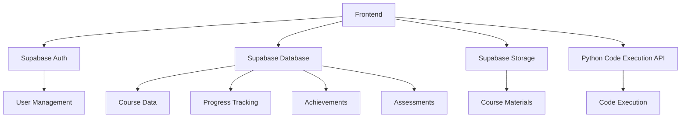
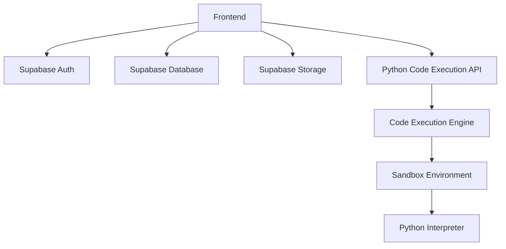
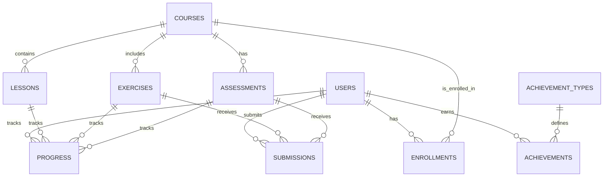

## 1. Architecture Design


## 2. Technology Description
- Frontend: React@18 + Tailwind CSS@3 + Vite
- Initialization Tool: vite-init
- Backend: Supabase (Authentication, Database, Storage)
- Database: Supabase (PostgreSQL)
- Additional Services: Python code execution API (for interactive coding exercises)

## 3. Route Definitions
| Route | Purpose |
|-------|---------|
| / | Home page with featured courses and dashboard |
| /courses | Course listing page |
| /courses/:id | Course details page |
| /courses/:id/lessons/:lessonId | Lesson content page |
| /courses/:id/exercises/:exerciseId | Interactive exercise page |
| /courses/:id/assessments/:assessmentId | Assessment page |
| /dashboard | User dashboard with progress and achievements |
| /achievements | User achievements and certificates |
| /profile | User profile page |
| /login | Login page |
| /register | Registration page |

## 4. API Definitions
### 4.1 Supabase Auth API
- Authentication endpoints for user registration, login, and password reset
- JWT token management for secure user sessions

### 4.2 Python Code Execution API
- Endpoint: `/api/execute-python`
- Method: POST
- Request Body: `{"code": "python code here"}`
- Response: `{"output": "execution output", "error": "error message if any"}`

## 5. Server Architecture Diagram


## 6. Data Model
### 6.1 Data Model Definition


### 6.2 Data Definition Language
```sql
-- Users Table
CREATE TABLE users (
  id UUID PRIMARY KEY REFERENCES auth.users(id),
  full_name TEXT,
  email TEXT UNIQUE,
  role TEXT DEFAULT 'student',
  created_at TIMESTAMP WITH TIME ZONE DEFAULT NOW()
);

-- Courses Table
CREATE TABLE courses (
  id SERIAL PRIMARY KEY,
  title TEXT NOT NULL,
  description TEXT,
  category TEXT,
  difficulty TEXT,
  duration INTEGER, -- in hours
  image_url TEXT,
  created_at TIMESTAMP WITH TIME ZONE DEFAULT NOW()
);

-- Lessons Table
CREATE TABLE lessons (
  id SERIAL PRIMARY KEY,
  course_id INTEGER REFERENCES courses(id),
  title TEXT NOT NULL,
  content TEXT,
  video_url TEXT,
  order_index INTEGER,
  created_at TIMESTAMP WITH TIME ZONE DEFAULT NOW()
);

-- Exercises Table
CREATE TABLE exercises (
  id SERIAL PRIMARY KEY,
  course_id INTEGER REFERENCES courses(id),
  lesson_id INTEGER REFERENCES lessons(id),
  title TEXT NOT NULL,
  description TEXT,
  instructions TEXT,
  difficulty TEXT,
  created_at TIMESTAMP WITH TIME ZONE DEFAULT NOW()
);

-- Assessments Table
CREATE TABLE assessments (
  id SERIAL PRIMARY KEY,
  course_id INTEGER REFERENCES courses(id),
  title TEXT NOT NULL,
  description TEXT,
  type TEXT, -- quiz, project, etc.
  passing_score INTEGER,
  created_at TIMESTAMP WITH TIME ZONE DEFAULT NOW()
);

-- Enrollments Table
CREATE TABLE enrollments (
  id SERIAL PRIMARY KEY,
  user_id UUID REFERENCES users(id),
  course_id INTEGER REFERENCES courses(id),
  enrolled_at TIMESTAMP WITH TIME ZONE DEFAULT NOW(),
  completed_at TIMESTAMP WITH TIME ZONE
);

-- Progress Table
CREATE TABLE progress (
  id SERIAL PRIMARY KEY,
  user_id UUID REFERENCES users(id),
  course_id INTEGER REFERENCES courses(id),
  lesson_id INTEGER REFERENCES lessons(id),
  exercise_id INTEGER REFERENCES exercises(id),
  assessment_id INTEGER REFERENCES assessments(id),
  status TEXT, -- started, completed
  score INTEGER,
  completed_at TIMESTAMP WITH TIME ZONE
);

-- Submissions Table
CREATE TABLE submissions (
  id SERIAL PRIMARY KEY,
  user_id UUID REFERENCES users(id),
  exercise_id INTEGER REFERENCES exercises(id),
  assessment_id INTEGER REFERENCES assessments(id),
  content TEXT, -- code or text submission
  score INTEGER,
  feedback TEXT,
  submitted_at TIMESTAMP WITH TIME ZONE DEFAULT NOW()
);

-- Achievement Types Table
CREATE TABLE achievement_types (
  id SERIAL PRIMARY KEY,
  name TEXT NOT NULL,
  description TEXT,
  icon_url TEXT,
  condition TEXT -- criteria for earning the achievement
);

-- Achievements Table
CREATE TABLE achievements (
  id SERIAL PRIMARY KEY,
  user_id UUID REFERENCES users(id),
  achievement_type_id INTEGER REFERENCES achievement_types(id),
  earned_at TIMESTAMP WITH TIME ZONE DEFAULT NOW()
);

-- Grant permissions
GRANT SELECT ON users, courses, lessons, exercises, assessments, enrollments, progress, submissions, achievement_types, achievements TO anon;
GRANT ALL PRIVILEGES ON users, courses, lessons, exercises, assessments, enrollments, progress, submissions, achievement_types, achievements TO authenticated;

-- Initial data
INSERT INTO achievement_types (name, description, icon_url, condition) VALUES
('First Course', 'Complete your first course', 'badge-first-course.svg', 'Complete 1 course'),
('Python Master', 'Master Python basics', 'badge-python-master.svg', 'Complete Python basics course'),
('Data Visualizer', 'Create your first data visualization', 'badge-data-visualizer.svg', 'Complete data visualization course'),
('Machine Learner', 'Learn machine learning fundamentals', 'badge-machine-learner.svg', 'Complete machine learning course'),
('10 Exercises', 'Complete 10 exercises', 'badge-10-exercises.svg', 'Complete 10 exercises'),
('5 Courses', 'Complete 5 courses', 'badge-5-courses.svg', 'Complete 5 courses');

INSERT INTO courses (title, description, category, difficulty, duration, image_url) VALUES
('Python Basics for Data Analysis', 'Learn the fundamentals of Python programming for data analysis', 'Python', 'Beginner', 10, 'python-basics.jpg'),
('Data Visualization with Python', 'Create stunning visualizations with Matplotlib and Seaborn', 'Data Visualization', 'Intermediate', 8, 'data-visualization.jpg'),
('Machine Learning Fundamentals', 'Introduction to machine learning concepts and algorithms', 'Machine Learning', 'Intermediate', 12, 'machine-learning.jpg'),
('Business Analytics with Python', 'Apply data analysis techniques to business problems', 'Business Analytics', 'Advanced', 15, 'business-analytics.jpg'),
('SQL for Data Analysts', 'Learn SQL for data querying and analysis', 'Databases', 'Beginner', 6, 'sql.jpg');
```